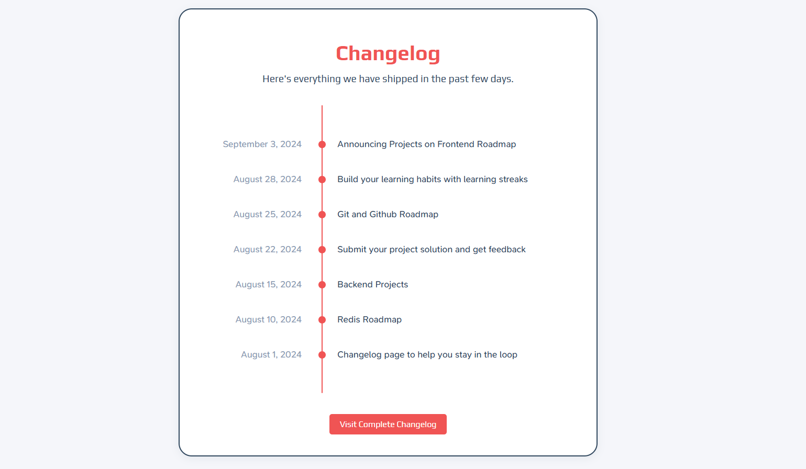

# Changelog Component



A simple and visually appealing changelog component to display updates and changes in your project. This component is built with HTML and CSS, making it easy to integrate into any web project.

A simple and visually appealing changelog component to display updates and changes in your project. This component is built with HTML and CSS, making it easy to integrate into any web project.

## Features
- Clean and modern design
- Responsive layout
- Easy to customize
- Highlights recent updates with dates and descriptions

## Demo
[View the Changelog Component Project Page](https://roadmap.sh/projects/changelog-component)

## Getting Started

### Prerequisites
- A modern web browser
- No build tools or frameworks required

### How to Run the Project
1. Clone or download this repository.
2. Navigate to the `frontend/4-changelog-component` directory.
3. Open the `index.html` file in your web browser.

```
frontend/
└── 4-changelog-component/
	├── index.html
	├── styles.css
	└── README.md
```

### Customization
- Edit the `index.html` file to update the changelog dates and descriptions.
- Modify `styles.css` to change the appearance as needed.

## Project Page
For more details and live demo, visit: [Changelog Component](https://roadmap.sh/projects/changelog-component)

---

**Author:** Jorim Pablico

---

Feel free to contribute or suggest improvements!
